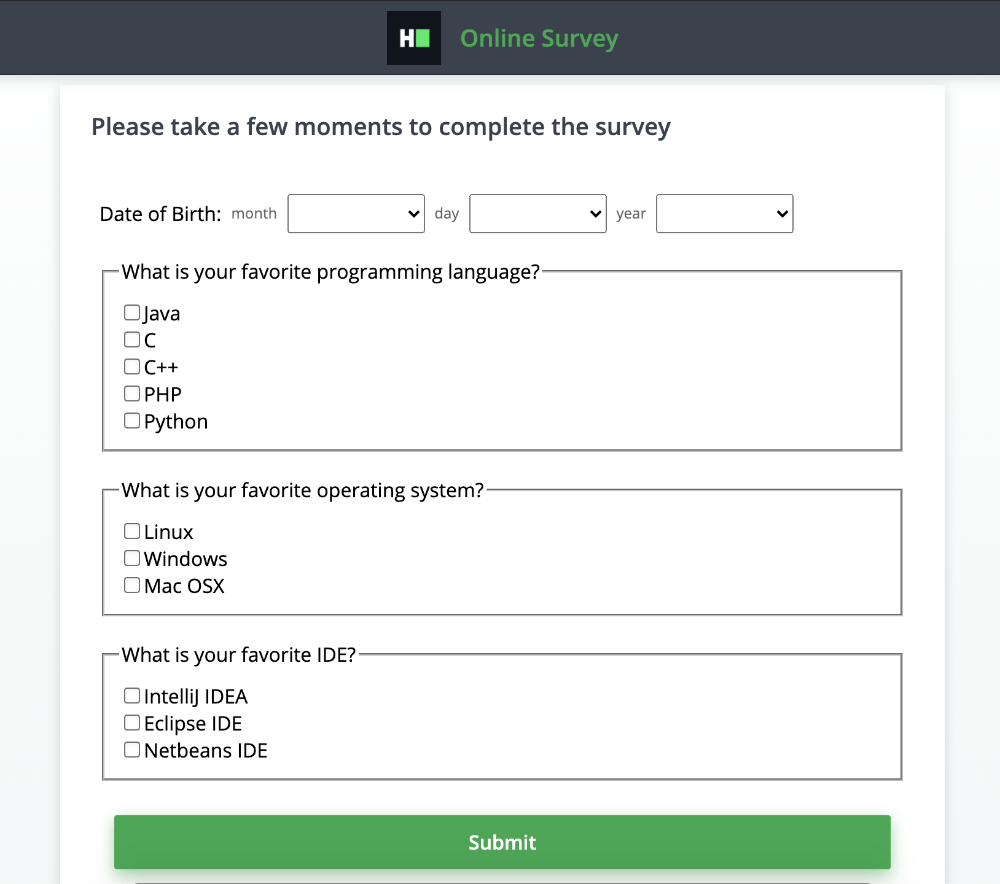

## Environment:
- Java version: 1.8
- Maven version: 3.*
- Selenium HtmlUnitDriver: 2.52.0

## Read-Only Files:
- src/test/*
- website/*

## Requirements:
In this challenge, you are going to use the Selenium WebDriver, the HtmlUnitDriver, which uses the HtmlUnit headless browser. This means you don't need to set up the browser (like Firefox or Chrome) nor a web driver executable (like FirefoxDriver or ChromeDriver). Every web page has web elements (aka DOM objects) with unique names or ids. Names are usually unique, but this is not a restriction. 

There is a class `OnlineSurvey` that has 2 methods:

1. `fillDateOfBirth`: You can choose any value for the month, day, and year in the give survey.
2. `answerQuestions`: You can choose any one option for each of the questions in the given survey.

These methods have 2 parameters, one web driver and one web page URL. The page that will be supplied is website/home.html, which will look like the following:




Your task is to complete the implementation of these 2 methods so that the unit tests pass while running the tests.

## Commands
- run: 
```bash
mvn clean package; java -jar target/selenium-java-dropdowns-and-checkboxes-1.0.jar
```
- install: 
```bash
mvn clean install
```
- test: 
```bash
mvn clean test
```
